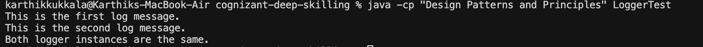

# Singleton Pattern Example: Logger

This project shows a simple example of the Singleton design pattern in Java.

What is in the code?

Logger class: This class uses the Singleton pattern. It means only one Logger object can ever exist. You get the Logger by calling `Logger.getInstance()`. It has a `log(String message)` method to print messages. When the Logger is created, it prints a message to show it was made.

LoggerTest class: This class has the `main` method. It gets the Logger instance twice, logs two different messages, and checks if both Logger objects are actually the same (they should be!).

How to Run
1. Compile the code:
   ```sh
   javac LoggerTest.java
   ```
2. Run the program:
   ```sh
   java LoggerTest
   ```

Example Output



- The first two lines are the log messages.
- The last line tells you if both Logger instances are the same (they should be, because of the Singleton pattern).
