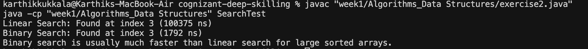

# Exercise 2: Search Algorithms & Big O Notation

## What is Big O Notation?
Big O Notation is a way to describe how fast (or slow) an algorithm is as the input gets bigger. It helps us compare the efficiency of different algorithms. For searching:
- **Best case:** The item is found right away (first try).
- **Average case:** The item is found somewhere in the middle.
- **Worst case:** The item is found last, or not at all (we look at everything).

## What's in this code?
- A `Product` class with id, name, and category.
- Two search methods:
  - `linearSearch()` (O(n)): Checks each product one by one.
  - `binarySearch()` (O(log n)): Works on sorted arrays, splits the search in half each time.
- A `SearchTest` class to show how both searches work and compare their speed.

## How to Run
1. Compile the code:
   ```sh
   javac "week1/Algorithms_Data Structures/exercise2.java"
   ```
2. Run the test:
   ```sh
   java -cp "week1/Algorithms_Data Structures" SearchTest
   ```

## Example Output Screenshot



- The output shows the index where the product was found and how long each search took (in nanoseconds).
- Binary search is usually much faster than linear search for large sorted arrays. 