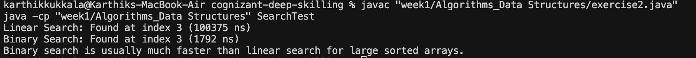

# Financial Forecasting with Recursion

This calculates future investment value using a recursive method.

## How recursion works

Recursion is when a function calls itself. It's good for problems that can be broken into smaller pieces. Like calculating compound interest - each year builds on the previous year.

## What the code does

**FinancialForecast class**: 
- `forecast()` method that calls itself to calculate compound growth
- Each call handles one year, then calls itself for the remaining years
- Base case: when years = 0, just return the current value

**FinancialForecastTest class**: 
- Tests the forecast with sample values
- Shows predicted value after 3 years with 5% growth

## Running it

Compile:
```sh
javac "week1/Algorithms_Data Structures/Exercise 7 - Financial Forecasting.java"
```

Run:
```sh
java -cp "week1/Algorithms_Data Structures" FinancialForecastTest
```

## Output



Shows the predicted value after compound interest is applied.

## Performance

The recursive approach is O(n) where n is the number of years. For better performance with large numbers, you could use a simple loop instead of recursion. 