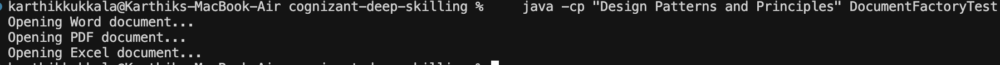

# Factory Method Pattern - Document Creator

This shows how to use the Factory Method pattern to create different types of documents.

## How it works

Instead of creating documents directly, I use factories to make them. Each factory knows how to create one specific type of document.

**Document interface**: Just says all documents need an `open()` method

**Concrete Documents**: 
- WordDocument, PdfDocument, ExcelDocument
- Each one prints a different message when opened

**Factories**:
- DocumentFactory (abstract base class)
- WordDocumentFactory, PdfDocumentFactory, ExcelDocumentFactory
- Each factory creates its specific document type

**Test class**: Shows how to use each factory to create and open documents

## Running it

Compile:
```sh
javac "Design Patterns and Principles/DocumentFactoryTest.java"
```

Run:
```sh
java -cp "Design Patterns and Principles" DocumentFactoryTest
```

## Output

```
Opening Word document...
Opening PDF document...
Opening Excel document...
```



The pattern lets you add new document types easily without changing existing code. 