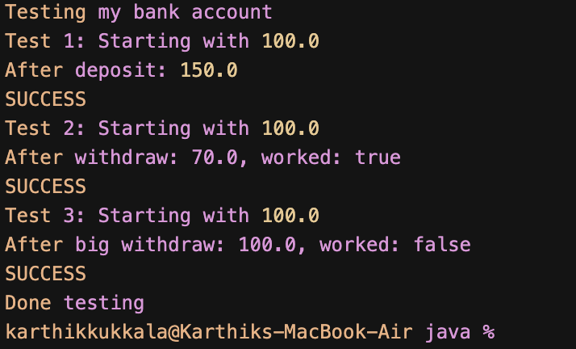

# JUnit Basic Testing Exercises-4 - AAA Pattern

## What I Built

This is my fourth JUnit exercise where I learned about the Arrange-Act-Assert (AAA) pattern and how to use @Before and @After annotations. I created a BankAccount class and wrote tests for it using proper testing structure.


## What I Learned

In this exercise, I practiced the AAA pattern which means:

1. **Arrange** - Set up the test data and objects
2. **Act** - Call the method I want to test
3. **Assert** - Check if the result is what I expected

I also learned about:
- **@Before** - Runs before each test to set up common data
- **@After** - Runs after each test to clean up

## The Classes

### BankAccount.java
A simple bank account class with:
- Constructor to create account with name and starting balance
- deposit() method to add money
- withdraw() method to take money out
- getBalance() to check current balance
- getAccountHolder() to get the account name

### BankAccountTest.java
My test class that shows the AAA pattern:
- Uses @Before to create a fresh account for each test
- Uses @After to clean up after each test
- Tests deposit, withdraw, and account holder functionality
- Each test follows Arrange-Act-Assert structure

## How to Run

### Using Java directly:
```bash
cd aaa-pattern-app/src/main/java
javac com/example/aaa/*.java
java com.example.aaa.TestDemo
```

## What the Demo Shows

The TestDemo.java shows how the BankAccount works without needing JUnit. It tests the same functionality but prints results manually so I can see what's happening.

## Key Concepts

- **AAA Pattern** helps organize tests in a clear way
- **@Before** sets up fresh data for each test
- **@After** cleans up after tests
- **Test isolation** means each test runs independently
- **assertEquals** with delta for comparing double values

This exercise taught me how to write well-structured tests that are easy to understand and maintain.

## Example Output



The screenshot shows the successful execution of all AAA pattern tests, demonstrating how each test follows the Arrange-Act-Assert structure with proper setup and cleanup. 