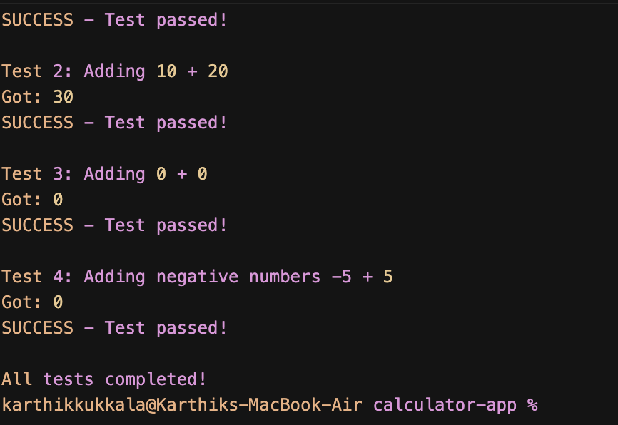

# JUnit Basic Testing Exercises

This is a simple Maven project demonstrating basic JUnit testing with a Calculator class.


## What I built

**Calculator.java**: A simple calculator that can add two numbers. I made it with an `add()` method that takes two integers and gives back their sum.

**CalculatorTest.java**: This is where I test my calculator to make sure it works right. I use:
- `@Test` to tell JUnit this is a test method
- `assertEquals` to check if my calculator gives the right answer when I add 5 + 3

**pom.xml**: This file tells Maven what libraries I need. I added JUnit 4.13.2 for testing.

## Dependencies

I'm using JUnit version 4.13.2 for my tests:

```xml
<dependency>
    <groupId>junit</groupId>
    <artifactId>junit</artifactId>
    <version>4.13.2</version>
    <scope>test</scope>
</dependency>
```

## How to run this

If you have Maven on your computer:

1. Go to the calculator-app folder:
   ```bash
   cd calculator-app
   ```

2. Run my tests:
   ```bash
   mvn test
   ```

3. Build the project:
   ```bash
   mvn compile
   ```

## Example Output



The screenshot shows the test results when running the Calculator tests, demonstrating that all tests pass successfully.

## If you don't have Maven

You can still run this but you'll need to:

1. Download the JUnit JAR files
2. Compile everything with the right classpath
3. Run the tests manually

## About my test

My `testAdd()` method does this:
- Makes a new Calculator object called `myCalculator`
- Sets up two numbers: 5 and 3
- Calls the add method and stores the result
- Checks if the result equals 8 (which it should!)
- If it doesn't equal 8, the test fails

This is my first time writing unit tests and it's pretty cool to see how I can automatically check if my code works correctly! 