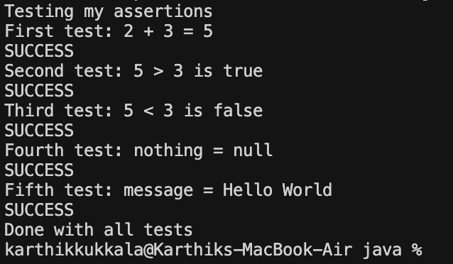

# JUnit Basic Testing Exercises 3 - Assertions

## What I Built

This is my third JUnit exercise where I learned about different types of assertions in JUnit testing. I created a test class that demonstrates five different assertion methods that JUnit provides.

## What I Learned

In this exercise, I practiced using different JUnit assertion methods:

1. **assertEquals** - Checks if two values are equal
2. **assertTrue** - Verifies that a condition is true
3. **assertFalse** - Verifies that a condition is false
4. **assertNull** - Confirms that a value is null
5. **assertNotNull** - Confirms that a value is not null

## The Test Class

My `AssertionsTest` class has one test method called `testAssertions()` that demonstrates all five assertion types:

- Tests if 2 + 3 equals 5 using assertEquals
- Checks if 5 is greater than 3 using assertTrue
- Verifies that 5 is not less than 3 using assertFalse
- Confirms a null value using assertNull
- Confirms a new object is not null using assertNotNull

## How to Run

### Using Maven (if available):
```bash
cd assertions-app
mvn test
```

### Using Java directly:
```bash
cd assertions-app/src/main/java
javac com/example/assertions/AssertionDemo.java
java com.example.assertions.AssertionDemo
```

## What the Demo Shows

The `AssertionDemo.java` file shows what each assertion is testing without needing JUnit. It demonstrates the same concepts but prints out the results manually so I can understand what each assertion type does.

## Key Concepts

- **Assertions** are statements that check if something is true or false
- **@Test** annotation marks a method as a test method
- **Static imports** let me use assert methods without typing the full class name
- **JUnit** automatically runs all methods marked with @Test

This exercise helped me understand the basic building blocks of unit testing and how to verify different types of conditions in my code.

## Example Output



The screenshot shows the successful execution of all assertion tests, demonstrating that each assertion type works correctly. 