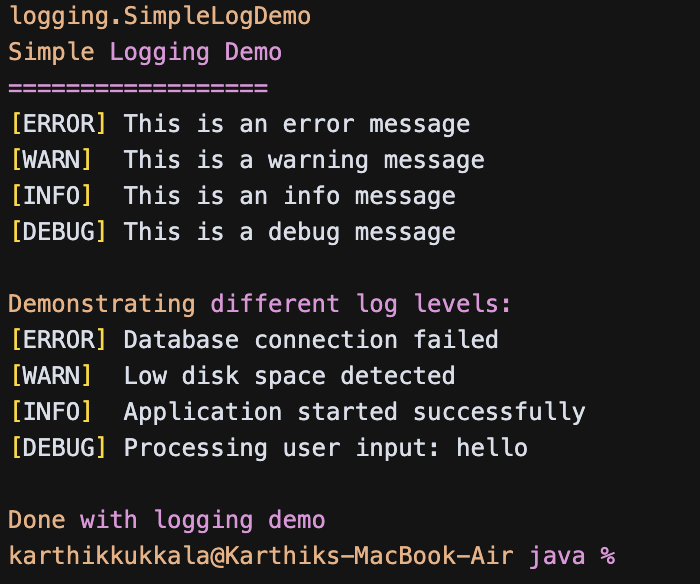

# SLF4J Logging Exercises

## What I Built

This is my SLF4J logging exercise where I learned how to use logging in Java applications. I created a program that demonstrates different log levels like error, warning, info, and debug messages using SLF4J with Logback.

## What I Learned

In this exercise, I practiced:

- **SLF4J API** - Simple Logging Facade for Java
- **Logback** - Logging backend implementation
- **Log Levels** - ERROR, WARN, INFO, DEBUG hierarchy
- **Logger Configuration** - Setting up logging behavior
- **Console Logging** - Outputting logs to the console

## The Classes

### LoggingExample.java
The main class that demonstrates SLF4J logging:
- Creates a Logger using `LoggerFactory.getLogger()`
- Logs error message: "This is an error message"
- Logs warning message: "This is a warning message"
- Logs info and debug messages for bonus demonstration

### SimpleLogDemo.java  
A demo class that shows logging concepts without SLF4J:
- Uses simple `System.out.println()` to simulate logging
- Shows different log levels with prefixes
- Demonstrates various log scenarios

## Configuration Files

### pom.xml
Maven dependencies for SLF4J and Logback:
- `slf4j-api` - The logging interface
- `logback-classic` - The logging implementation

### logback.xml
Logback configuration file:
- Console appender for output
- Log pattern with timestamp and level
- Root level set to INFO (shows INFO, WARN, ERROR but not DEBUG)

## How to Run

### Using Java directly:
```bash
cd logging-app/src/main/java
javac com/example/logging/*.java
java com.example.logging.SimpleLogDemo
```

### Using Maven (if available):
```bash
cd logging-app
mvn compile exec:java -Dexec.mainClass="com.example.logging.LoggingExample"
```

## Log Levels Hierarchy

1. **ERROR** - Serious problems that should be fixed
2. **WARN** - Potential issues that need attention  
3. **INFO** - General information about application flow
4. **DEBUG** - Detailed information for troubleshooting

## What You'll See

With the default INFO level configuration:
- ✅ ERROR messages appear
- ✅ WARN messages appear
- ✅ INFO messages appear
- ❌ DEBUG messages are filtered out

## Key SLF4J Concepts

- **Logger Creation**: `Logger logger = LoggerFactory.getLogger(MyClass.class)`
- **Logging Methods**: `logger.error()`, `logger.warn()`, `logger.info()`, `logger.debug()`
- **Backend Independence**: SLF4J works with different logging backends
- **Configuration**: Logback XML configures output format and levels

## Benefits of Logging

- **Debugging** - Track down problems in code
- **Monitoring** - Watch application behavior
- **Auditing** - Keep records of important events
- **Performance** - Better than using print statements

This exercise taught me how to properly log messages in Java applications instead of using System.out.println() everywhere.

## Example Output



The screenshot shows the successful execution of the SimpleLogDemo, demonstrating all four log levels (ERROR, WARN, INFO, DEBUG) in action with both basic logging statements and practical examples like database errors and application status messages. 