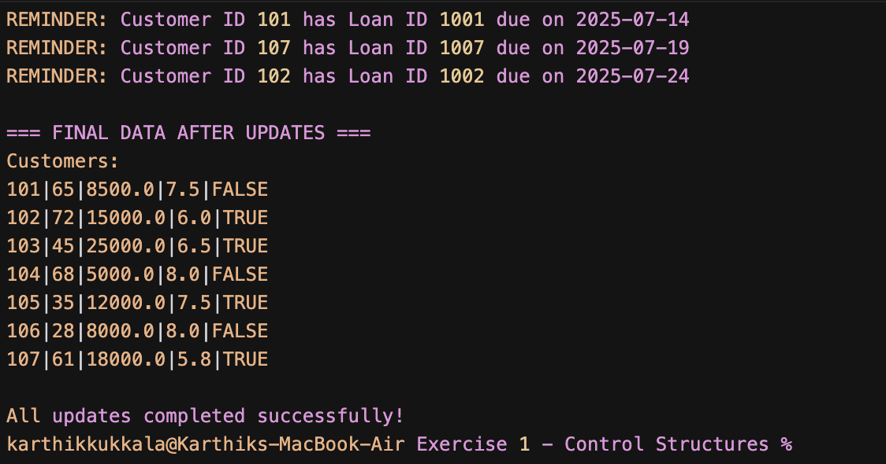

# Exercise 1: Control Structures in PL/SQL

## Overview
This exercise demonstrates the use of PL/SQL control structures including explicit cursors, loops, and conditional statements to manage customer and loan data.

## What This Script Does

The PL/SQL anonymous block performs three main operations:

1. **Senior Customer Interest Rate Reduction**
   - Finds all customers over 60 years old
   - Reduces their current loan interest rate by 1%
   - Updates the database with the new rates

2. **VIP Status Update**
   - Checks all customers with balance greater than 10,000
   - Updates their VIP status to 'TRUE'
   - Provides confirmation messages

3. **Loan Payment Reminders**
   - Identifies loans due within the next 30 days
   - Prints reminder messages with customer ID and loan ID
   - Shows formatted due dates

## Database Requirements

Before running this script, you need tables with the following structure:

### Customers Table
```sql
CREATE TABLE Customers (
    customer_id NUMBER PRIMARY KEY,
    age NUMBER,
    balance NUMBER,
    current_loan_rate NUMBER,
    IsVIP VARCHAR2(10)
);
```

### Loans Table
```sql
CREATE TABLE Loans (
    loan_id NUMBER PRIMARY KEY,
    customer_id NUMBER,
    due_date DATE,
    FOREIGN KEY (customer_id) REFERENCES Customers(customer_id)
);
```

## How to Run

1. Connect to your Oracle database
2. Make sure the required tables exist with sample data
3. Run the script: `customer_loan_management.sql`
4. Check the output messages for processing results

## Example Output Screenshot



The screenshot shows the execution results including:
- Interest rate updates for senior customers (age > 60)
- VIP status updates for high-balance customers (balance > 10,000)
- Loan reminders for loans due within 30 days
- Final data state after all updates

## Sample Output
```
Processing senior customers for interest rate reduction...
Customer ID: 101 - Age: 65 - New Rate: 7.5%
Customer ID: 102 - Age: 72 - New Rate: 6.0%

Processing customers for VIP status update...
Customer ID: 201 - Balance: 15000 - VIP Status Updated
Customer ID: 202 - Balance: 25000 - VIP Status Updated

Processing loan reminders for next 30 days...
REMINDER: Customer ID 101 has Loan ID 1001 due on 15-JUL-2024
REMINDER: Customer ID 203 has Loan ID 1002 due on 22-JUL-2024

All updates completed successfully.
```

## Key PL/SQL Concepts Used

- **Explicit Cursors**: Used to fetch specific sets of data
- **LOOP statements**: Process each row returned by cursors
- **FETCH INTO**: Retrieve cursor data into variables
- **IF conditions**: Check business rules (age > 60, balance > 10000)
- **Exception Handling**: Rollback changes if errors occur
- **COMMIT/ROLLBACK**: Ensure data consistency

## Notes

- The script uses simple PL/SQL syntax without advanced packages
- All database changes are committed at the end
- Error handling ensures data integrity
- Output messages provide clear feedback on operations performed 