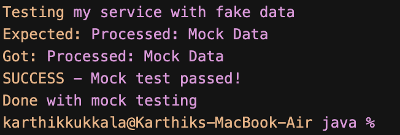

# Mockito Exercises 1 - Mocking External APIs

## What I Built

This is my first Mockito exercise where I learned how to mock external dependencies in unit tests. I created a service class that depends on an external API and wrote tests using Mockito to mock that dependency.

## What I Learned

In this exercise, I practiced:

- **Mocking** - Creating fake objects that behave like real ones
- **Stubbing** - Making mock objects return specific values
- **Dependency Injection** - Passing dependencies through constructors
- **Unit Testing** - Testing individual components in isolation

## The Classes

### ExternalApi.java
A simple interface that represents an external API:
- Has one method `getData()` that returns a String

### MyService.java  
A service class that depends on ExternalApi:
- Takes ExternalApi in constructor
- Has `fetchData()` method that calls the API and processes the result

### MyServiceTest.java
My test class using Mockito:
- Creates a mock of ExternalApi using `Mockito.mock()`
- Stubs the `getData()` method to return "Mock Data" using `when().thenReturn()`
- Tests that `fetchData()` returns the expected processed result
- Uses `assertEquals()` to verify the output

## How to Run

### Using Java directly:
```bash
cd mockito-app/src/main/java
javac com/example/mockito/*.java
java com.example.mockito.MockDemo
```

### Using Maven (if available):
```bash
cd mockito-app
mvn test
```

## What the Demo Shows

The MockDemo.java shows the concept of mocking without needing Mockito libraries. It creates a fake implementation of ExternalApi that returns "Mock Data" and tests the service with it.

## Key Concepts

- **Mock Objects** replace real dependencies in tests
- **Stubbing** controls what mock methods return
- **Isolation** lets us test one class without depending on others
- **@Test** marks methods as test cases
- **assertEquals()** checks if actual result matches expected result

## Mockito Methods Used

- `Mockito.mock(Class)` - Creates a mock object
- `when(method).thenReturn(value)` - Stubs method to return specific value
- Static imports make the code cleaner

This exercise taught me how to write tests that don't depend on external systems, making them faster and more reliable.

## Example Output



The screenshot shows the successful execution of the MockDemo, demonstrating how mocking works by returning fake data instead of calling a real external API. 