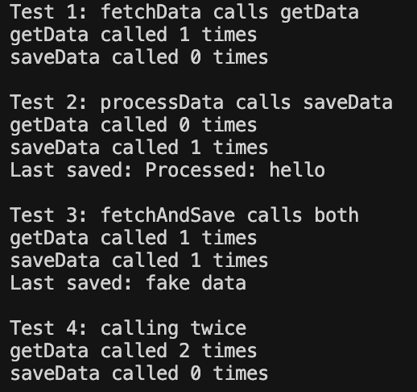

# Mockito Exercises 2 - Method Verification

## What I Built

This is my second Mockito exercise where I learned how to verify that methods are called with the right arguments and the correct number of times. I created tests that check if my service class calls the external API methods properly.

## What I Learned

In this exercise, I practiced:

- **Method Verification** - Checking if methods were actually called
- **Argument Verification** - Making sure methods were called with correct parameters
- **Call Counting** - Verifying how many times methods were invoked
- **Multiple Verifications** - Testing different aspects of method calls

## The Classes

### ExternalApi.java
An interface with two methods:
- `getData()` - Returns a String
- `saveData(String data)` - Saves data (void method)

### MyService.java  
A service class with three methods to test:
- `fetchData()` - Calls `getData()` once
- `processData(String input)` - Calls `saveData()` with processed input
- `fetchAndSave()` - Calls both `getData()` and `saveData()`

### MyServiceTest.java
My test class using Mockito verify:
- Tests that `fetchData()` calls `getData()`
- Tests that `processData()` calls `saveData()` with correct argument
- Tests that `fetchAndSave()` calls both methods exactly once
- Tests multiple calls are counted correctly

## How to Run

### Using Java directly:
```bash
cd mockito-verify-app/src/main/java
javac com/example/verify/*.java
java com.example.verify.VerifyDemo
```

### Using Maven (if available):
```bash
cd mockito-verify-app
mvn test
```

## What the Demo Shows

The VerifyDemo.java shows verification concepts without Mockito. It creates a fake API that counts method calls and shows what arguments were passed.

## Key Verification Methods

- `verify(mock).method()` - Checks if method was called
- `verify(mock).method(argument)` - Checks method called with specific argument
- `verify(mock, times(n)).method()` - Checks method called exactly n times
- `verify(mock, times(1)).method()` - Same as basic verify (default is 1 time)

## Test Cases Covered

1. **Basic Verification** - Method was called
2. **Argument Verification** - Method called with correct parameter
3. **Multiple Method Verification** - Both methods called in one operation
4. **Call Count Verification** - Method called specific number of times

## What I Verified

- `getData()` is called when fetching data
-  `saveData()` is called with processed input
- Both methods called in `fetchAndSave()`
- Multiple calls are counted correctly
- Arguments passed are exactly what we expect

This exercise taught me how to make sure my code is calling external dependencies correctly, which is important for testing business logic without depending on real external systems.

## Example Output



The screenshot shows the successful execution of the VerifyDemo, demonstrating how method call verification works by counting the number of times each method is called and tracking the arguments passed to them. 