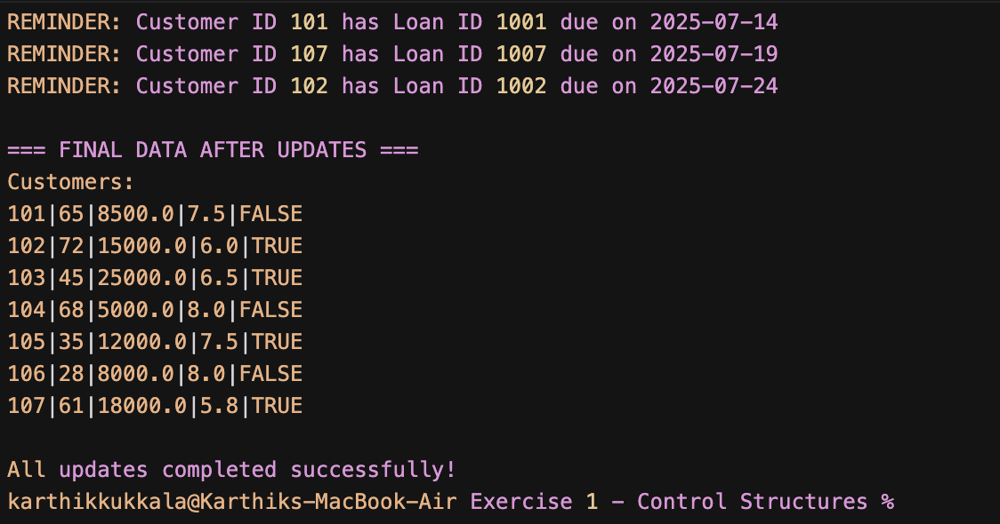

# PL/SQL Control Structures - Customer Management

This PL/SQL script handles customer and loan management tasks using cursors and loops.

## What it does

The script does three things:

1. **Helps senior customers**: Gives 1% interest rate discount to customers over 60
2. **Updates VIP status**: Makes customers with balance > 10,000 into VIPs  
3. **Sends loan reminders**: Shows which loans are due in the next 30 days

## Database setup

You need two tables:

**Customers table**:
```sql
CREATE TABLE Customers (
    customer_id NUMBER PRIMARY KEY,
    age NUMBER,
    balance NUMBER,
    current_loan_rate NUMBER,
    IsVIP VARCHAR2(10)
);
```

**Loans table**:
```sql
CREATE TABLE Loans (
    loan_id NUMBER PRIMARY KEY,
    customer_id NUMBER,
    due_date DATE
);
```

## Running the script

1. Make sure your database has the tables with some test data
2. Run: `customer_loan_management.sql`
3. Check the output to see what changed

## What you'll see



The output shows:
- Which senior customers got rate reductions
- Which customers became VIPs
- Upcoming loan due dates
- Confirmation that everything worked

## Sample output
```
Processing senior customers for interest rate reduction...
Customer ID: 101 - Age: 65 - New Rate: 7.5%
Customer ID: 102 - Age: 72 - New Rate: 6.0%

Processing customers for VIP status update...
Customer ID: 201 - Balance: 15000 - VIP Status Updated
Customer ID: 202 - Balance: 25000 - VIP Status Updated

Processing loan reminders for next 30 days...
REMINDER: Customer ID 101 has Loan ID 1001 due on 15-JUL-2024
REMINDER: Customer ID 203 has Loan ID 1002 due on 22-JUL-2024

All updates completed successfully.
```

## PL/SQL features used

- **Cursors**: To get specific customer data
- **Loops**: Process each customer one by one
- **IF statements**: Check age and balance conditions
- **Variables**: Store customer info temporarily
- **Error handling**: Rollback if something goes wrong

The script is pretty straightforward and shows basic PL/SQL database operations. 