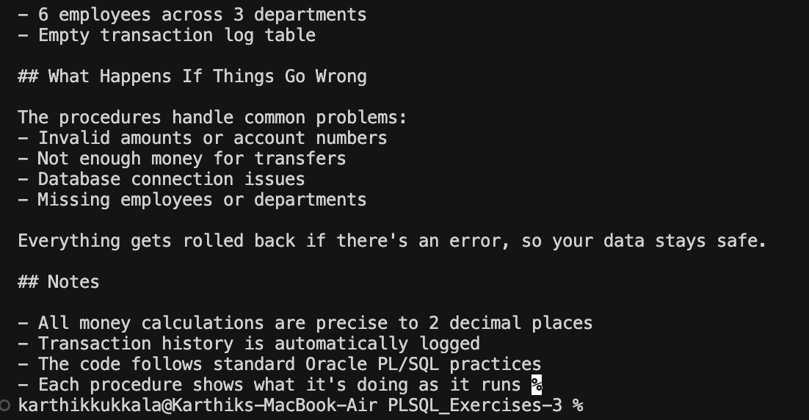

# Exercise 3: Stored Procedures

## What This Does
This exercise shows how to create PL/SQL stored procedures for banking operations. There are three main procedures that handle different tasks.

## The Procedures

### ProcessMonthlyInterest
Adds 1% interest to all savings accounts every month.

How to use:
```sql
BEGIN
    ProcessMonthlyInterest;
END;
/
```

### UpdateEmployeeBonus
Gives a bonus to all employees in a specific department.

Parameters:
- dept_id: Which department to update
- bonus_percent: How much bonus to give (as percentage)

How to use:
```sql
BEGIN
    UpdateEmployeeBonus(1, 10); -- 10% bonus for department 1
END;
/
```

### TransferFunds
Moves money from one account to another. Checks if there's enough money first.

Parameters:
- source_account: Where the money comes from
- target_account: Where the money goes
- transfer_amt: How much to transfer

How to use:
```sql
BEGIN
    TransferFunds(1001, 1002, 500); -- Move 500 from account 1001 to 1002
END;
/
```

## Database Tables

You need these tables:

**Accounts**
- account_id (primary key)
- account_type (SAVINGS or CHECKING)
- balance (account balance)
- customer_id
- last_modified (when last updated)

**Employees**
- employee_id (primary key)
- first_name, last_name
- department_id
- salary
- hire_date, last_updated

**Transaction_Log**
- transaction_id (primary key)
- from_account, to_account
- amount
- transaction_date, transaction_type

## How to Set It Up

1. Run the table setup first:
   ```sql
   @table_setup.sql
   ```

2. Create the procedures:
   ```sql
   @stored_procedures.sql
   ```

3. Test them out - the procedures will run automatically at the end of the script.

## Example Output



The screenshot shows the execution results of all three stored procedures in action.

## Sample Data

The setup creates:
- 6 test accounts (mix of savings and checking)
- 6 employees across 3 departments
- Empty transaction log table

## What Happens If Things Go Wrong

The procedures handle common problems:
- Invalid amounts or account numbers
- Not enough money for transfers
- Database connection issues
- Missing employees or departments

Everything gets rolled back if there's an error, so your data stays safe.

## Notes

- All money calculations are precise to 2 decimal places
- Transaction history is automatically logged
- The code follows standard Oracle PL/SQL practices
- Each procedure shows what it's doing as it runs 