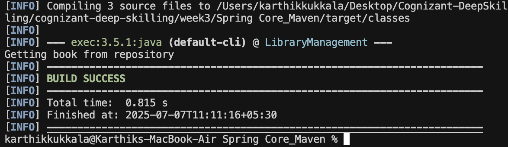

# Spring Core Maven: LibraryManagement

This is a simple project to show how Spring Core works with XML configuration in a Maven project.

## What This Project Does

- Sets up a Maven project called `LibraryManagement`.
- Adds Spring Core to the dependencies.
- Uses an XML file to set up two beans: `BookService` and `BookRepository`.
- `BookRepository` has a method that prints a message.
- `BookService` uses `BookRepository` and has a method that calls it.
- There's a `MainApp` class that loads the Spring context and runs the code.

## How to Run It

1. Open a terminal in this folder.
2. Run this command:
   ```
   mvn clean compile exec:java -Dexec.mainClass="com.library.main.MainApp"
   ```
3. You should see a message like:
   ```
   Getting book from repository
   ```

## Example Output

Here's a screenshot of what you'll see when you run it:



---
This project is for learning how to use Spring Core with XML config. It's made to be easy to follow for beginners. 