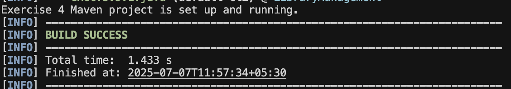

# Exercise 4: Creating and Configuring a Maven Project

This exercise shows how to set up a new Maven project for the library management app and add Spring dependencies.

## Scenario
You need to set up a new Maven project for the library management application and add Spring dependencies.

## Steps
1. Create a new Maven project named LibraryManagement.
2. Add Spring Context, Spring AOP, and Spring WebMVC dependencies in pom.xml.
3. Set up the Maven Compiler Plugin for Java 1.8 in the pom.xml file.

## Example Output

Here's a screenshot of the output when you run the Exercise 4 Maven project:

 