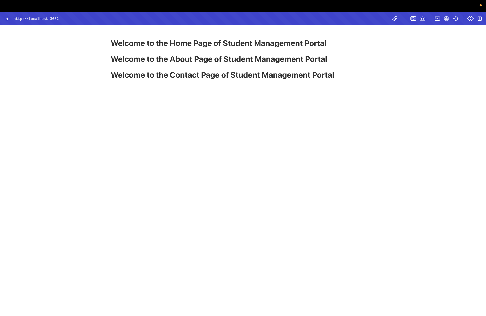

# Student Management Portal - React Components Lab

## Objectives

- Explain React components
- Identify the differences between components and JavaScript functions
- Identify the types of components
- Explain class component
- Explain function component
- Define component constructor
- Define render() function

## Project Overview

This React application demonstrates the creation and usage of multiple class components in a Student Management Portal. The app showcases:

- **Class Components**: Three separate class components (Home, About, Contact)
- **Component Structure**: Proper import/export patterns
- **Component Rendering**: Multiple components rendered in a single app
- **JSX Syntax**: HTML-like syntax in JavaScript

## Components

### Home Component
- **File**: `src/Components/Home.js`
- **Type**: Class Component
- **Message**: "Welcome to the Home Page of Student Management Portal"

### About Component
- **File**: `src/Components/About.js`
- **Type**: Class Component
- **Message**: "Welcome to the About Page of Student Management Portal"

### Contact Component
- **File**: `src/Components/Contact.js`
- **Type**: Class Component
- **Message**: "Welcome to the Contact Page of Student Management Portal"

## Project Structure

```
src/
├── Components/
│   ├── Home.js      # Home component
│   ├── About.js     # About component
│   └── Contact.js   # Contact component
├── App.js           # Main app component
├── App.css          # Application styles
└── index.js         # Entry point
```

## Key Concepts Demonstrated

- **Class Components**: Using `class` syntax with `Component` inheritance
- **render() Method**: Required method that returns JSX
- **Component Import/Export**: Proper module system usage
- **Component Composition**: Multiple components in one app
- **JSX**: HTML-like syntax in JavaScript

## Getting Started

### Prerequisites

- Node.js
- NPM
- Visual Studio Code

### Installation

1. Navigate to the project directory
2. Install dependencies:
   ```bash
   npm install
   ```

### Running the Application

Start the development server:
```bash
npm start
```

Open [http://localhost:3000](http://localhost:3000) to view the application.

## Expected Output

The application will display three welcome messages:
1. "Welcome to the Home Page of Student Management Portal"
2. "Welcome to the About Page of Student Management Portal"
3. "Welcome to the Contact Page of Student Management Portal"



The screenshot shows the successful rendering of all three components in the browser at localhost:3002, demonstrating the proper functioning of the React class components.

## Available Scripts

- `npm start` - Runs the app in development mode
- `npm test` - Launches the test runner
- `npm run build` - Builds the app for production
- `npm run eject` - Ejects from Create React App

## Learn More

- [React Documentation](https://reactjs.org/)
- [React Components](https://reactjs.org/docs/components-and-props.html)
- [Class Components](https://reactjs.org/docs/react-component.html)
