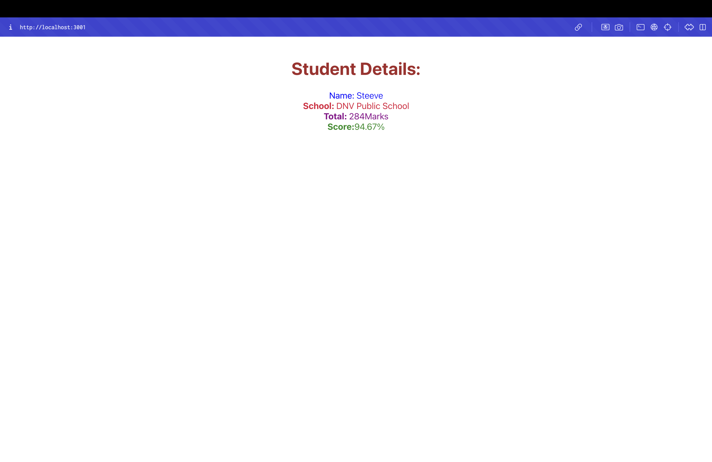

# Score Calculator - React Functional Components Lab

## Objectives

- Explain React components
- Identify the differences between components and JavaScript functions
- Identify the types of components
- Explain class component
- Explain function component
- Define component constructor
- Define render() function

## Project Overview

This React application demonstrates the creation and usage of functional components with props and styling. The app showcases:

- **Functional Components**: Using arrow function syntax with props destructuring
- **Component Props**: Passing data from parent to child components
- **Component Styling**: External CSS files for component styling
- **Score Calculation**: Mathematical operations within components
- **JSX Syntax**: HTML-like syntax in JavaScript

## Components

### CalculateScore Component
- **File**: `src/Components/CalculateScore.js`
- **Type**: Functional Component (Arrow Function)
- **Props**: `Name`, `School`, `total`, `goal`
- **Functionality**: Calculates and displays student score as percentage

## Project Structure

```
src/
├── Components/
│   └── CalculateScore.js    # Score calculation component
├── Stylesheets/
│   └── mystyle.css         # Component styling
├── App.js                  # Main app component
├── App.css                 # Application styles
└── index.js                # Entry point
```

## Key Concepts Demonstrated

- **Functional Components**: Using arrow function syntax
- **Props Destructuring**: Extracting props directly in function parameters
- **Helper Functions**: Internal functions for calculations
- **External Styling**: CSS imports for component styling
- **Mathematical Operations**: Score calculation with percentage formatting
- **Component Composition**: Single component with complex logic

## Score Calculation Logic

The component includes two helper functions:
- `percentToDecimal()`: Formats decimal to percentage with 2 decimal places
- `calcScore()`: Calculates percentage score from total and goal values

## Styling Classes

- `.Name`: Blue color, light font weight
- `.School`: Crimson color
- `.Total`: Dark magenta color
- `.Score`: Forest green color
- `.formatstyle`: Centered text, large font size

## Getting Started

### Prerequisites

- Node.js
- NPM
- Visual Studio Code

### Installation

1. Navigate to the project directory
2. Install dependencies:
   ```bash
   npm install
   ```

### Running the Application

Start the development server:
```bash
npm start
```

Open [http://localhost:3000](http://localhost:3000) to view the application.

## Expected Output

The application will display student details with calculated score:
- **Name**: Steeve (blue)
- **School**: DNV Public School (crimson)
- **Total**: 284 Marks (dark magenta)
- **Score**: 94.67% (forest green)



The screenshot shows the successful rendering of the CalculateScore functional component in the browser at localhost:3001, displaying student details with different colored styling and the calculated percentage score.

## Available Scripts

- `npm start` - Runs the app in development mode
- `npm test` - Launches the test runner
- `npm run build` - Builds the app for production
- `npm run eject` - Ejects from Create React App

## Learn More

- [React Documentation](https://reactjs.org/)
- [Functional Components](https://reactjs.org/docs/components-and-props.html)
- [Props in React](https://reactjs.org/docs/components-and-props.html#props-are-read-only)
