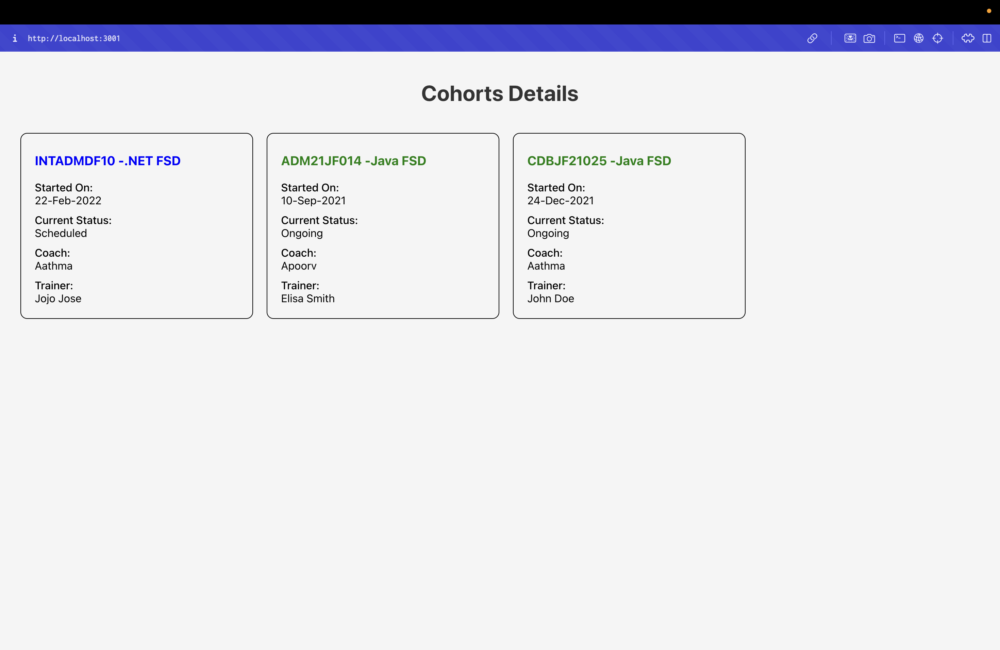

# Cohort Tracker - React CSS Modules Lab

## Objectives

- Understanding the need for styling React components
- Working with CSS Module and inline styles

## Project Overview

This React application demonstrates the implementation of CSS modules and inline styling in React components. The app showcases:

- **CSS Modules**: Scoped styling with .module.css files
- **Inline Styles**: Dynamic styling based on component state
- **Component Styling**: Applying styles using className and style properties
- **Conditional Styling**: Dynamic colors based on cohort status

## Components

### CohortDetails Component
- **File**: `src/CohortDetails.js`
- **Type**: Functional Component
- **Styling**: CSS Module + Inline Styles
- **Functionality**: Displays cohort information with conditional styling

### CSS Module
- **File**: `src/CohortDetails.module.css`
- **Features**: Scoped CSS classes and tag selectors
- **Classes**: `.box` for cohort cards
- **Selectors**: `dt` for definition terms

## Project Structure

```
src/
├── CohortDetails.js           # Main component with cohort data
├── CohortDetails.module.css   # CSS module for styling
├── App.js                     # Main app component
├── App.css                    # Application styles
└── index.js                   # Entry point
```

## Key Concepts Demonstrated

- **CSS Modules**: Scoped styling to prevent conflicts
- **Inline Styles**: Dynamic styling with JavaScript
- **Conditional Styling**: Colors based on cohort status
- **Component Styling**: className and style properties
- **Tag Selectors**: Styling HTML elements directly

## CSS Module Implementation

### Box Class
```css
.box {
  width: 300px;
  display: inline-block;
  margin: 10px;
  padding: 10px 20px;
  border: 1px solid black;
  border-radius: 10px;
}
```

### Tag Selector
```css
dt {
  font-weight: 500;
}
```

## Inline Styling

The component uses inline styles for dynamic color based on status:
- **Green**: For "Ongoing" status
- **Blue**: For all other statuses (Scheduled, Completed, etc.)

## Cohort Data

The application displays three cohorts:
1. **INTADMDF10 -.NET FSD** (Scheduled - Blue)
2. **ADM21JF014 -Java FSD** (Ongoing - Green)
3. **CDBJF21025 -Java FSD** (Ongoing - Green)

Each cohort shows:
- Cohort ID/Name
- Started On date
- Current Status
- Coach name
- Trainer name

## Getting Started

### Prerequisites

- Node.js
- NPM
- Visual Studio Code

### Installation

1. Navigate to the project directory
2. Install dependencies:
   ```bash
   npm install
   ```

### Running the Application

Start the development server:
```bash
npm start
```

Open [http://localhost:3000](http://localhost:3000) to view the application.

## Expected Output

The application will display:
- "Cohorts Details" heading
- Three cohort cards arranged horizontally
- Each card with cohort information
- Green color for ongoing cohorts
- Blue color for scheduled/completed cohorts
- Proper spacing and styling



The screenshot shows the successful rendering of the CohortDetails component with CSS modules and inline styling. The dashboard displays three cohort cards with conditional color styling - green for ongoing cohorts and blue for scheduled cohorts, demonstrating the implementation of CSS modules and dynamic styling. The application is running on localhost:3001.

## Available Scripts

- `npm start` - Runs the app in development mode
- `npm test` - Launches the test runner
- `npm run build` - Builds the app for production
- `npm run eject` - Ejects from Create React App

## Learn More

- [React Documentation](https://reactjs.org/)
- [CSS Modules](https://github.com/css-modules/css-modules)
- [React Inline Styles](https://reactjs.org/docs/dom-elements.html#style)
- [React className](https://reactjs.org/docs/dom-elements.html#className)
