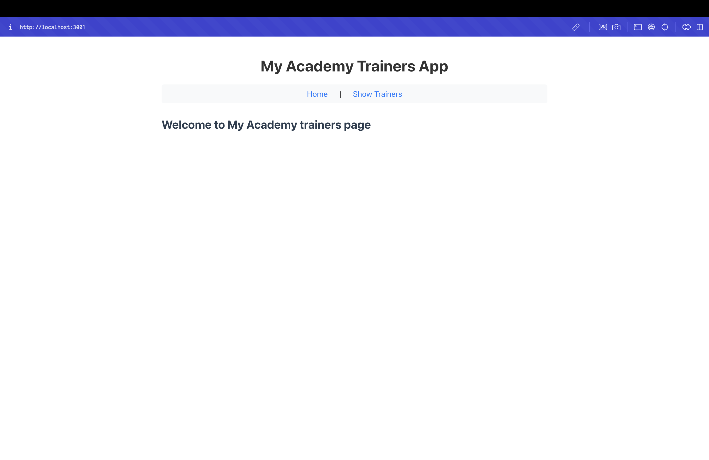
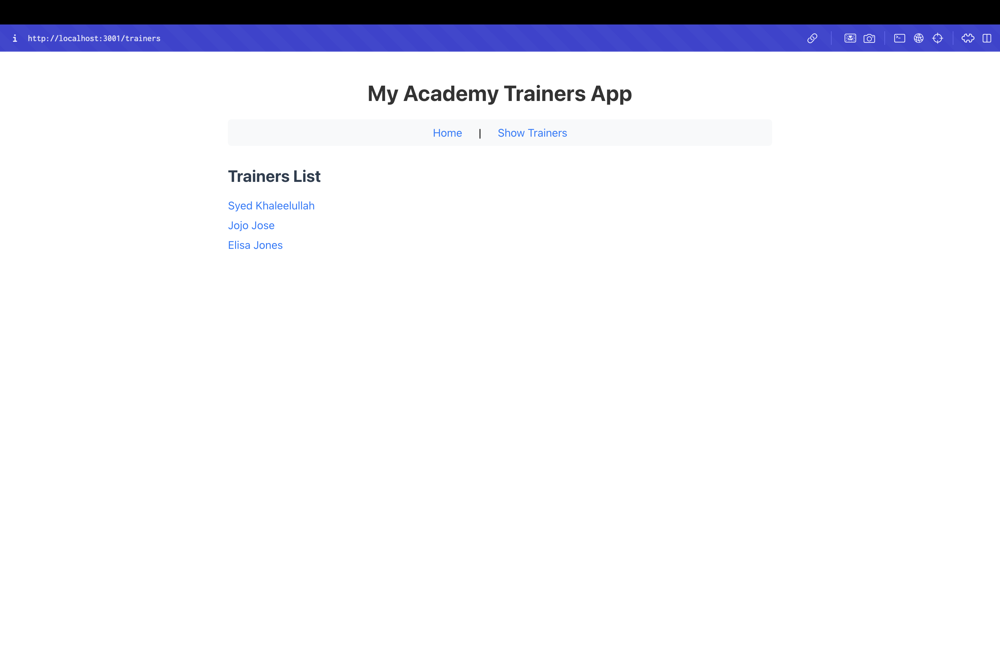

# Trainers App - React Router Lab

## Objectives

- Explain the need and benefits of React Router
- Identify the Components in React Router
- List the types of Router Components
- Parameter passing via URL

## Project Overview

This React application demonstrates the implementation of React Router for navigation in a Single Page Application (SPA). The app showcases:

- **React Router DOM**: BrowserRouter, Routes, Route, Link components
- **Navigation Menu**: Simple navigation with links
- **Parameter Passing**: URL parameters for dynamic routing
- **Component Routing**: Multiple components with different routes
- **Mock Data**: Trainer information with skills and details

## Components

### Trainer Class
- **File**: `src/trainer.js`
- **Type**: JavaScript Class
- **Properties**: trainerId, name, email, phone, technology, skills
- **Purpose**: Data model for trainer information

### TrainersMock
- **File**: `src/TrainersMock.js`
- **Type**: Mock Data Array
- **Content**: Three trainer instances with complete information
- **Purpose**: Provides sample data for the application

### Home Component
- **File**: `src/Home.js`
- **Type**: Functional Component
- **Content**: Welcome message for the academy
- **Route**: `/` (root path)

### TrainersList Component
- **File**: `src/TrainersList.js`
- **Type**: Functional Component
- **Functionality**: Displays list of trainers as clickable links
- **Route**: `/trainers`
- **Features**: Links to individual trainer details

### TrainerDetail Component
- **File**: `src/TrainerDetail.js`
- **Type**: Functional Component
- **Features**: Uses useParams hook for URL parameters
- **Route**: `/trainer/:id`
- **Functionality**: Displays detailed trainer information

### App Component
- **File**: `src/App.js`
- **Type**: Main Application Component
- **Features**: BrowserRouter, Routes, Route, Link
- **Navigation**: Home and Show Trainers links

## Project Structure

```
src/
├── trainer.js              # Trainer class definition
├── TrainersMock.js         # Mock trainer data
├── Home.js                 # Home component
├── TrainersList.js         # Trainers list component
├── TrainerDetail.js        # Trainer detail component
├── App.js                  # Main app with routing
├── App.css                 # Application styles
└── index.js                # Entry point
```

## Key Concepts Demonstrated

- **BrowserRouter**: Wraps the entire application for routing
- **Routes**: Container for all route definitions
- **Route**: Individual route with path and element
- **Link**: Navigation links that don't reload the page
- **useParams**: Hook for accessing URL parameters
- **Parameter Passing**: Dynamic routing with trainer IDs

## Routing Implementation

### Route Definitions
- `/` - Home component (welcome page)
- `/trainers` - TrainersList component (list of trainers)
- `/trainer/:id` - TrainerDetail component (individual trainer details)

### Navigation
- **Home**: Links to root path `/`
- **Show Trainers**: Links to `/trainers` path
- **Trainer Names**: Links to `/trainer/:id` with specific trainer ID

## Trainer Data

The application includes three trainers:
1. **Syed Khaleelullah** (.NET) - C#, SQL Server, React, .NET Core
2. **Jojo Jose** (Java) - Java, JSP, Angular, Spring
3. **Elisa Jones** (Python) - Python, Django, Angular

## Getting Started

### Prerequisites

- Node.js
- NPM
- Visual Studio Code

### Installation

1. Navigate to the project directory
2. Install dependencies:
   ```bash
   npm install
   ```

### Running the Application

Start the development server:
```bash
npm start
```

Open [http://localhost:3000](http://localhost:3000) to view the application.

## Expected Output

The application will display:
- **Home Page**: Welcome message with navigation
- **Trainers List**: Clickable list of trainer names
- **Trainer Details**: Detailed information for selected trainer
- **Navigation**: Links between different sections

### Application Screenshots

#### Home Page


The screenshot shows the home page of the Trainers App with the welcome message "Welcome to My Academy trainers page" and navigation links "Home | Show Trainers". The application is running on localhost:3001.

#### Trainers List Page


The screenshot shows the trainers list page displaying the three trainer names as clickable links: "Syed Khaleelullah", "Jojo Jose", and "Elisa Jones". The application is running on localhost:3001.

## Available Scripts

- `npm start` - Runs the app in development mode
- `npm test` - Launches the test runner
- `npm run build` - Builds the app for production
- `npm run eject` - Ejects from Create React App

## Learn More

- [React Documentation](https://reactjs.org/)
- [React Router Documentation](https://reactrouter.com/)
- [React Router DOM](https://reactrouter.com/en/main/start/overview)
- [URL Parameters](https://reactrouter.com/en/main/hooks/use-params)
