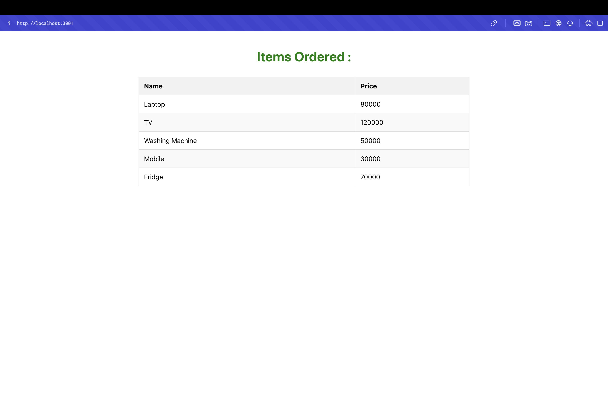

# Shopping App - React Props Lab

## Objectives

- Define Props
- Explain Default Props
- Identify the differences between State and Props
- Explain reactDOM.render()

## Project Overview

This React application demonstrates the implementation of props in React components. The app showcases:

- **Props Usage**: Passing data from parent to child components
- **Class Components**: Using class components with props
- **Data Flow**: Parent component passing array data to child component
- **Component Communication**: Props as a way to pass data between components

## Components

### Cart Component
- **File**: `src/Cart.js`
- **Type**: Class Component
- **Props**: `item` (array of objects with itemname and price)
- **Functionality**: Displays items in a table format
- **Features**: Maps through props data to render table rows

### OnlineShopping Component
- **File**: `src/OnlineShopping.js`
- **Type**: Class Component
- **Data**: Creates array of shopping items
- **Props**: Passes item array to Cart component
- **Features**: Parent component that manages data

## Project Structure

```
src/
├── Cart.js                 # Cart component (child)
├── OnlineShopping.js       # OnlineShopping component (parent)
├── App.js                  # Main app component
├── App.css                 # Application styles
└── index.js                # Entry point
```

## Key Concepts Demonstrated

- **Props**: Data passing from parent to child components
- **Class Components**: Using React.Component with props
- **Data Flow**: One-way data flow from parent to child
- **Component Communication**: Props as communication mechanism
- **Array Mapping**: Rendering lists of data from props

## Props Implementation

### Data Structure
Each item in the array has two properties:
- `itemname`: String (name of the item)
- `price`: Number (price of the item)

### Props Flow
1. **OnlineShopping** creates `CartInfo` array with 5 items
2. **OnlineShopping** passes array as `item` prop to **Cart**
3. **Cart** receives props and maps through the array
4. **Cart** renders each item in a table row

## Shopping Items

The application displays five items:
1. **Laptop** - ₹80,000
2. **TV** - ₹1,20,000
3. **Washing Machine** - ₹50,000
4. **Mobile** - ₹30,000
5. **Fridge** - ₹70,000

## Getting Started

### Prerequisites

- Node.js
- NPM
- Visual Studio Code

### Installation

1. Navigate to the project directory
2. Install dependencies:
   ```bash
   npm install
   ```

### Running the Application

Start the development server:
```bash
npm start
```

Open [http://localhost:3000](http://localhost:3000) to view the application.

## Expected Output

The application will display:
- "Items Ordered :" heading in green
- Table with "Name" and "Price" columns
- Five shopping items with their prices
- Clean, bordered table layout



The screenshot shows the successful rendering of the Shopping App with props implementation. The application displays "Items Ordered :" heading in green, followed by a table showing five shopping items (Laptop, TV, Washing Machine, Mobile, Fridge) with their respective prices, demonstrating the props data flow from parent to child components.

## Available Scripts

- `npm start` - Runs the app in development mode
- `npm test` - Launches the test runner
- `npm run build` - Builds the app for production
- `npm run eject` - Ejects from Create React App

## Learn More

- [React Documentation](https://reactjs.org/)
- [React Props](https://reactjs.org/docs/components-and-props.html)
- [React Class Components](https://reactjs.org/docs/react-component.html)
- [React Lists and Keys](https://reactjs.org/docs/lists-and-keys.html)
