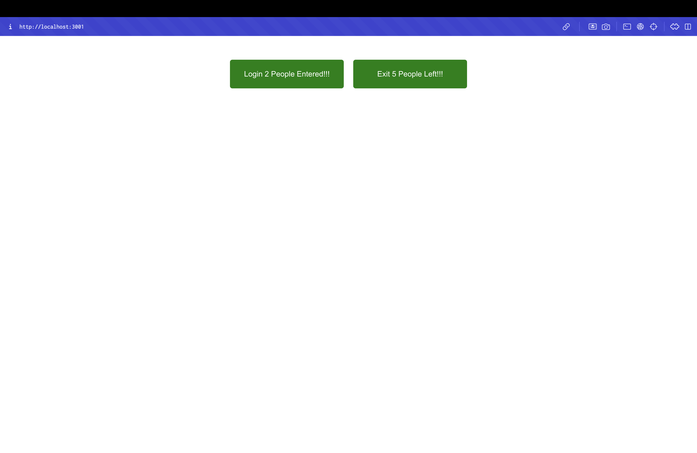

# CountPeople - React State Lab

## Objectives

- Explain React State
- Use React State object

## Prerequisites

The following is required to complete this hands-on lab:
- Node.js
- NPM
- Visual Studio Code

## Project Overview

This React application demonstrates the implementation of React State to track people entering and exiting a mall. The app showcases:

- **React State**: Using constructor and state object to store counters
- **State Updates**: Using setState with functional updates
- **Event Handling**: Button clicks to increment counters
- **Component Lifecycle**: Constructor initialization

## Components

### CountPeople Component
- **File**: `src/CountPeople.js`
- **Type**: Class Component
- **State Properties**: 
  - `entrycount`: Number of people who entered
  - `exitcount`: Number of people who exited
  - `c`: Additional state property (not used in functionality)
- **Methods**:
  - `updateEntry()`: Increments entrycount by 1
  - `updateExit()`: Increments exitcount by 1

## Implementation Details

### Constructor
```javascript
constructor() {
  super();
  this.state = {
    entrycount: 0,
    exitcount: 0,
    c: 0
  };
}
```

### State Update Methods
```javascript
updateEntry = () => {
  this.setState((prevState, props) => {
    return { entrycount: prevState.entrycount + 1 };
  });
};

updateExit = () => {
  this.setState((prevState, props) => {
    return { exitcount: prevState.exitcount + 1 };
  });
};
```

## Project Structure

```
src/
├── CountPeople.js    # Main component with state management
├── App.js           # Main app component
├── App.css          # Application styles
└── index.js         # Entry point
```

## Key Concepts Demonstrated

- **React State**: Initializing state in constructor
- **setState**: Using functional updates for state changes
- **Event Handling**: onClick events for button interactions
- **State Management**: Tracking multiple counters
- **Component Lifecycle**: Constructor initialization

## Getting Started

### Prerequisites

- Node.js
- NPM
- Visual Studio Code

### Installation

1. Navigate to the project directory
2. Install dependencies:
   ```bash
   npm install
   ```

### Running the Application

Start the development server:
```bash
npm start
```

Open [http://localhost:3000](http://localhost:3000) to view the application.

## Expected Output

The application will display:
- Two green buttons arranged horizontally
- **Login Button**: Shows "Login X People Entered!!!" where X is the count
- **Exit Button**: Shows "Exit Y People Left!!!" where Y is the count
- Clicking Login increments the entry count
- Clicking Exit increments the exit count

### Example Output
- After clicking Login 3 times: "Login 3 People Entered!!!"
- After clicking Exit 2 times: "Exit 2 People Left!!!"



The screenshot shows the successful rendering of the CountPeople component in the browser at localhost:3001, displaying two green buttons with the current counts: "Login 2 People Entered!!!" and "Exit 5 People Left!!!", demonstrating the React state management functionality.

## Available Scripts

- `npm start` - Runs the app in development mode
- `npm test` - Launches the test runner
- `npm run build` - Builds the app for production
- `npm run eject` - Ejects from Create React App

## Learn More

- [React Documentation](https://reactjs.org/)
- [React State](https://reactjs.org/docs/state-and-lifecycle.html)
- [setState](https://reactjs.org/docs/react-component.html#setstate)
