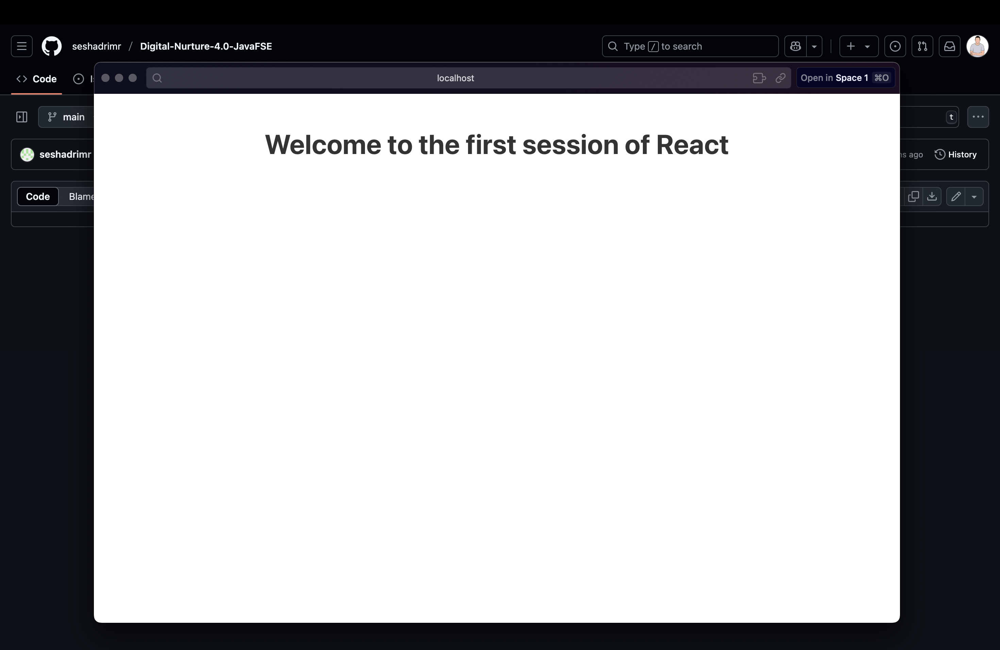

# ReactJS Hands-On Lab

## Objectives

- Define SPA and its benefits
- Define React and identify its working
- Identify the differences between SPA and MPA
- Explain Pros & Cons of Single-Page Application
- Explain about React
- Define virtual DOM
- Explain Features of React

## Project Overview

This React application demonstrates the basic concepts of React development. The app displays a simple welcome message to showcase React's component-based architecture.

## Application Output



The application displays "Welcome to the first session of React" as a heading, demonstrating:
- Single Page Application (SPA) functionality
- React component structure
- JSX syntax
- Virtual DOM rendering

## Getting Started

### Prerequisites

- Node.js
- NPM
- Visual Studio Code

### Installation

1. Clone or download this project
2. Navigate to the project directory
3. Install dependencies:
   ```bash
   npm install
   ```

### Running the Application

Start the development server:
```bash
npm start
```

Open [http://localhost:3000](http://localhost:3000) to view it in your browser.

## Available Scripts

- `npm start` - Runs the app in development mode
- `npm test` - Launches the test runner
- `npm run build` - Builds the app for production
- `npm run eject` - Ejects from Create React App (one-way operation)

## Project Structure

```
src/
├── App.js          # Main React component
├── App.css         # Component styles
├── index.js        # Application entry point
└── index.css       # Global styles
```

## Key Concepts Demonstrated

- **SPA (Single Page Application)**: The app loads once and updates content dynamically
- **React Components**: Functional component structure
- **JSX**: HTML-like syntax in JavaScript
- **Virtual DOM**: Efficient rendering and updates
- **Component-based Architecture**: Modular and reusable code structure

## Learn More

- [React Documentation](https://reactjs.org/)
- [Create React App Documentation](https://facebook.github.io/create-react-app/docs/getting-started)
