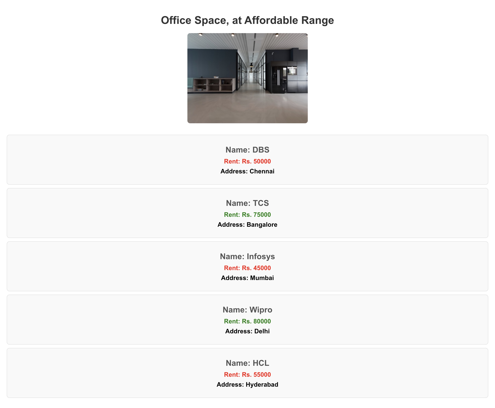

# Office Space Rental App - JSX Lab

## Objectives

- Define JSX
- Explain about ECMA Script
- Explain React.createElement()
- Explain how to create React nodes with JSX
- Define how to render JSX to DOM
- Explain how to use JavaScript expressions in JSX
- Explain how to use inline CSS in JSX

## Learning Outcomes

In this hands-on lab, you will learn how to:
- Use JSX syntax in React applications
- Use inline CSS in JSX

## Prerequisites

The following is required to complete this hands-on lab:
- Node.js
- NPM
- Visual Studio Code

## Project Overview

This React application demonstrates various JSX features through an office space rental interface. The app showcases:

- **JSX Elements**: Creating React elements using JSX syntax
- **JSX Attributes**: Using attributes in JSX elements
- **JavaScript Expressions**: Embedding JavaScript in JSX
- **Inline CSS**: Applying styles directly in JSX
- **Conditional Styling**: Dynamic colors based on rent values
- **Object Handling**: Working with objects in JSX
- **Array Mapping**: Looping through arrays to display data

## JSX Features Demonstrated

### 1. JSX Elements
```javascript
const element = "Office Space";
<h1>{element}, at Affordable Range</h1>
```

### 2. JSX Attributes
```javascript
const jsxatt = ;
```

### 3. JavaScript Expressions in JSX
```javascript
{officeSpaces.map((office, index) => (
  <div key={index}>
    <h2>Name: {office.Name}</h2>
    <h3>Rent: Rs. {office.Rent}</h3>
    <h3>Address: {office.Address}</h3>
  </div>
))}
```

### 4. Inline CSS in JSX
```javascript
<h3 style={{ 
  color: office.Rent <= 60000 ? 'red' : 'green',
  fontWeight: 'bold'
}}>
  Rent: Rs. {office.Rent}
</h3>
```

### 5. Conditional Styling
```javascript
const getRentColor = (rent) => {
  let colors = [];
  if (rent <= 60000) {
    colors.push('textRed');
  } else {
    colors.push('textGreen');
  }
  return colors[0];
};
```

## Project Structure

```
src/
├── App.js                # Main component with JSX features
├── App.css               # Application styles
└── index.js              # Entry point
```

## Office Space Data

The application includes five office spaces:
1. **DBS** - Rent: Rs. 50,000 (Red - below 60,000)
2. **TCS** - Rent: Rs. 75,000 (Green - above 60,000)
3. **Infosys** - Rent: Rs. 45,000 (Red - below 60,000)
4. **Wipro** - Rent: Rs. 80,000 (Green - above 60,000)
5. **HCL** - Rent: Rs. 55,000 (Red - below 60,000)

## Key Concepts Demonstrated

### JSX Elements and Attributes
- **JSX Element**: Creating React elements using JSX syntax
- **JSX Attributes**: Using attributes like `src`, `width`, `height`, `alt`
- **JavaScript Expressions**: Embedding JavaScript variables and expressions in JSX

### Object Handling
- **Object Properties**: Accessing object properties in JSX
- **Array Mapping**: Using `map()` to iterate through arrays
- **Key Prop**: Using unique keys for list items

### Inline CSS
- **Inline Styles**: Applying styles directly in JSX using `style` prop
- **Conditional Styling**: Dynamic colors based on rent values
- **CSS Classes**: Using predefined CSS classes

### Conditional Logic
- **Rent Color Logic**: Red for rent ≤ 60,000, Green for rent > 60,000
- **Ternary Operators**: Using ternary operators for conditional styling

## Getting Started

### Prerequisites

- Node.js
- NPM
- Visual Studio Code

### Installation

1. Navigate to the project directory
2. Install dependencies:
   ```bash
   npm install
   ```

### Running the Application

Start the development server:
```bash
npm start
```

Open [http://localhost:3000](http://localhost:3000) to view the application.

## Expected Output

The application will display:
1. **Heading**: "Office Space, at Affordable Range"
2. **Office Space Image**: A placeholder image of an office space
3. **Office Space Cards**: Multiple cards showing:
   - Office Name
   - Rent (colored red if ≤ 60,000, green if > 60,000)
   - Address

### Styling Features
- **Red Text**: Rent values ≤ 60,000
- **Green Text**: Rent values > 60,000
- **Card Layout**: Each office space in a styled card
- **Hover Effects**: Cards have hover animations



The screenshot shows the successful rendering of the Office Space Rental App, displaying the heading "Office Space, at Affordable Range", an office space image, and five office space cards with conditional rent coloring - red for rents ≤ 60,000 and green for rents > 60,000, demonstrating JSX elements, attributes, and inline CSS functionality.

## Key JSX Concepts

- **JSX Syntax**: HTML-like syntax in JavaScript
- **JavaScript Expressions**: Using `{}` to embed JavaScript
- **Attributes**: Using camelCase for attributes (e.g., `className`, `onClick`)
- **Inline Styles**: Using objects for CSS properties
- **Conditional Rendering**: Using JavaScript expressions for conditional logic

## Available Scripts

- `npm start` - Runs the app in development mode
- `npm test` - Launches the test runner
- `npm run build` - Builds the app for production
- `npm run eject` - Ejects from Create React App

## Learn More

- [React Documentation](https://reactjs.org/)
- [JSX Introduction](https://reactjs.org/docs/introducing-jsx.html)
- [JSX in Depth](https://reactjs.org/docs/jsx-in-depth.html)
- [Inline Styles](https://reactjs.org/docs/dom-elements.html#style)
- [Conditional Rendering](https://reactjs.org/docs/conditional-rendering.html)
