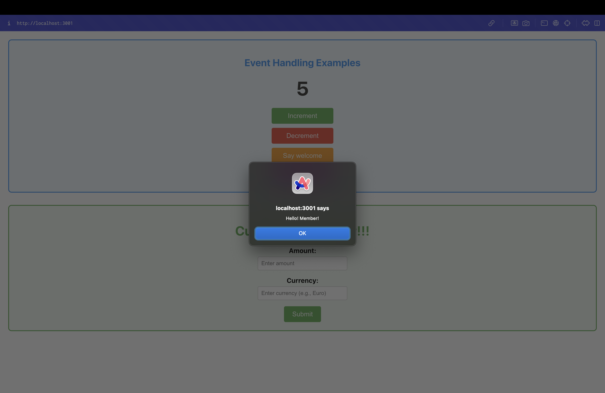
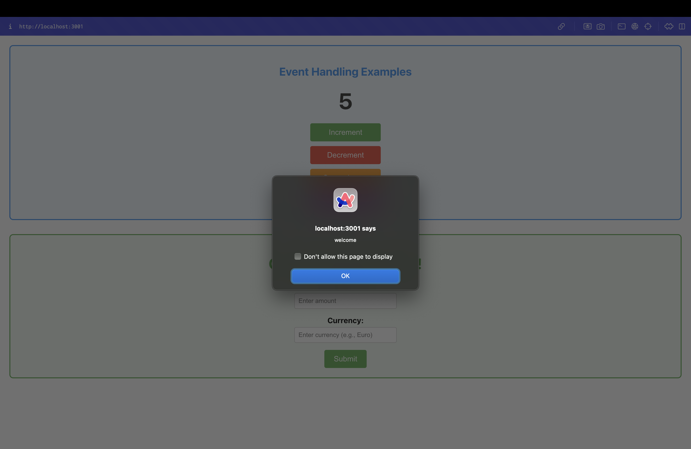
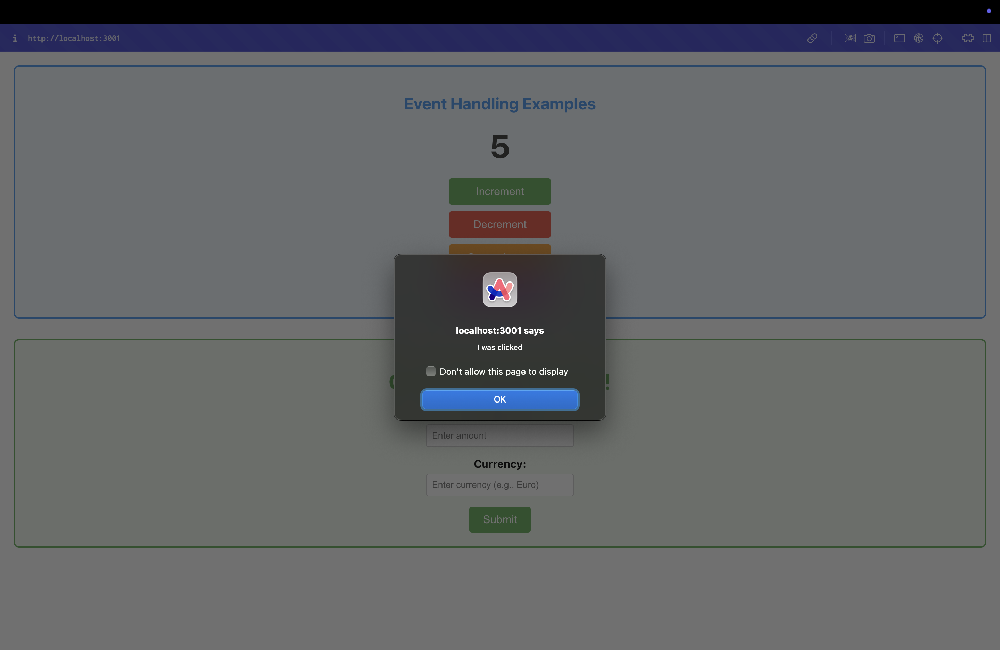
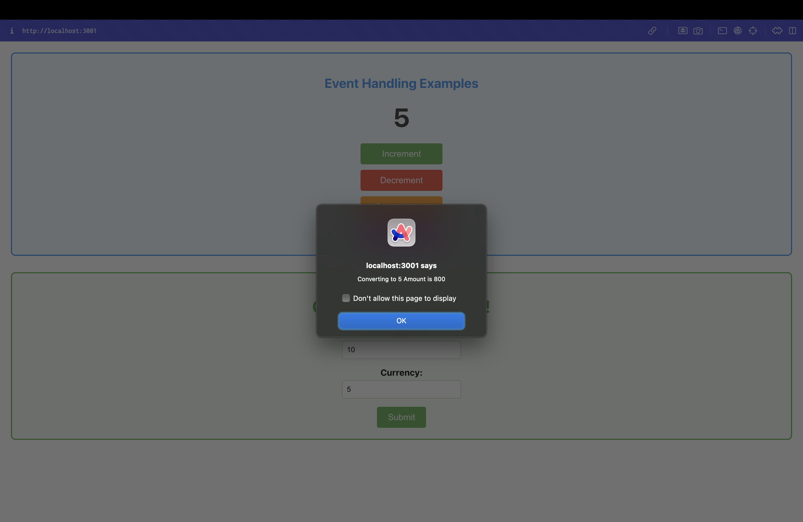
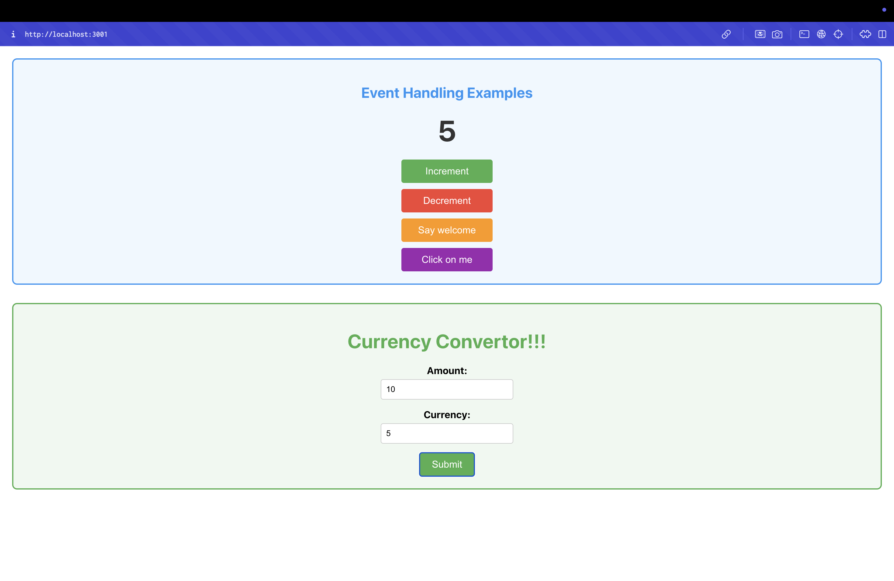

# Event Examples App - React Event Handling Lab

## Objectives

- Explain React events
- Explain about event handlers
- Define Synthetic event
- Identify React event naming convention

## Learning Outcomes

In this hands-on lab, you will learn how to:
- Implement Event handling concept in React applications
- Use this keyword
- Use synthetic event

## Prerequisites

The following is required to complete this hands-on lab:
- Node.js
- NPM
- Visual Studio Code

## Project Overview

This React application demonstrates various event handling concepts through interactive examples. The app showcases:

- **Event Handlers**: Using onClick events for button interactions
- **Synthetic Events**: React's cross-browser event system
- **State Management**: Using useState for counter functionality
- **Form Handling**: Currency converter with form submission
- **Alert Dialogs**: Using JavaScript alerts for user feedback

## Components

### App Component
- **File**: `src/App.js`
- **Type**: Functional Component
- **Features**: Counter functionality, multiple event handlers
- **State**: Counter value using useState

### CurrencyConvertor Component
- **File**: `src/CurrencyConvertor.js`
- **Type**: Functional Component
- **Features**: Form handling, currency conversion
- **State**: Amount and currency inputs using useState

## Event Handling Examples

### 1. Increment Button
```javascript
const handleIncrement = () => {
  setCounter(counter + 1);
  alert('Hello! Member!');
};
```
- **Functionality**: Increases counter value and shows alert
- **Multiple Methods**: Combines state update and user feedback

### 2. Decrement Button
```javascript
const handleDecrement = () => {
  setCounter(counter - 1);
};
```
- **Functionality**: Decreases counter value
- **Event Handler**: Simple state update

### 3. Say Welcome Button
```javascript
const handleSayWelcome = (message) => {
  alert(message);
};

// Usage
onClick={() => handleSayWelcome('welcome')}
```
- **Functionality**: Takes argument and displays alert
- **Event Handler**: Function with parameters

### 4. Synthetic Event Button
```javascript
const handleOnPress = () => {
  alert('I was clicked');
};
```
- **Functionality**: Demonstrates synthetic event handling
- **Synthetic Event**: React's cross-browser event system

## Currency Convertor Features

### Form Handling
```javascript
const handleSubmit = (e) => {
  e.preventDefault();
  // Conversion logic
  alert(`Converting to ${currency} Amount is ${convertedAmount}`);
};
```

### State Management
```javascript
const [amount, setAmount] = useState('');
const [currency, setCurrency] = useState('');
```

### Conversion Logic
```javascript
const conversionRate = 80;
const convertedAmount = parseFloat(amount) * conversionRate;
```

## Project Structure

```
src/
├── App.js                # Main component with event handlers
├── CurrencyConvertor.js  # Currency conversion component
├── App.css               # Application styles
└── index.js              # Entry point
```

## Key Concepts Demonstrated

### Event Handling
- **onClick Events**: Button click handlers
- **Event Handlers**: Functions that respond to events
- **Synthetic Events**: React's normalized event system
- **Event Naming**: camelCase convention (onClick, onChange)

### State Management
- **useState Hook**: Managing component state
- **State Updates**: Using setState functions
- **Controlled Components**: Form inputs with state

### Form Handling
- **onSubmit Event**: Form submission handling
- **onChange Events**: Input field change handling
- **preventDefault()**: Preventing default form behavior

### User Feedback
- **Alert Dialogs**: Using JavaScript alerts
- **Conditional Logic**: Form validation
- **Error Handling**: User input validation

## Getting Started

### Prerequisites

- Node.js
- NPM
- Visual Studio Code

### Installation

1. Navigate to the project directory
2. Install dependencies:
   ```bash
   npm install
   ```

### Running the Application

Start the development server:
```bash
npm start
```

Open [http://localhost:3000](http://localhost:3000) to view the application.

## Expected Output

### Event Handling Examples Section
1. **Counter Display**: Shows current counter value (starts at 5)
2. **Increment Button**: Increases counter and shows "Hello! Member!" alert
3. **Decrement Button**: Decreases counter value
4. **Say Welcome Button**: Shows "welcome" alert
5. **Click on me Button**: Shows "I was clicked" alert

### Currency Convertor Section
1. **Amount Input**: Enter numeric value
2. **Currency Input**: Enter currency name (e.g., "Euro")
3. **Submit Button**: Converts amount and shows result alert
4. **Conversion Logic**: 1 Euro = 80 Rupees (approximate)

### Example Interactions
- **Increment**: Counter increases, alert shows "Hello! Member!"
- **Say Welcome**: Alert shows "welcome"
- **Click on me**: Alert shows "I was clicked"
- **Currency Convert**: Enter 80, Euro → Alert shows "Converting to Euro Amount is 6400"

## Application Screenshots

### Event Handling Examples

#### Screenshot 1: Increment Button with Alert


Shows the application with the "Increment" button clicked, displaying the alert "Hello! Member!" while the counter value is 5.

#### Screenshot 2: Say Welcome Button with Alert


Shows the application with the "Say welcome" button clicked, displaying the alert "welcome" message.

#### Screenshot 3: Click on me Button with Alert


Shows the application with the "Click on me" button clicked, displaying the alert "I was clicked" demonstrating synthetic event handling.

#### Screenshot 4: Currency Converter with Alert


Shows the application with the currency converter form filled and submitted, displaying the conversion result alert.

#### Screenshot 5: Complete Application Interface


Shows the complete application interface with all buttons and the currency converter form, demonstrating the full React event handling functionality.

## Key Event Handling Concepts

### React Event Naming Convention
- **camelCase**: onClick, onChange, onSubmit
- **Cross-browser**: Synthetic events work across browsers
- **Normalized**: React normalizes event objects

### Event Handler Patterns
- **Arrow Functions**: `onClick={() => handleClick()}`
- **Direct Reference**: `onClick={handleClick}`
- **With Parameters**: `onClick={() => handleClick('param')}`

### Synthetic Events
- **Cross-browser**: Works consistently across browsers
- **Normalized**: React handles browser differences
- **Performance**: Event delegation for better performance

## Available Scripts

- `npm start` - Runs the app in development mode
- `npm test` - Launches the test runner
- `npm run build` - Builds the app for production
- `npm run eject` - Ejects from Create React App

## Learn More

- [React Documentation](https://reactjs.org/)
- [Event Handling](https://reactjs.org/docs/handling-events.html)
- [Synthetic Events](https://reactjs.org/docs/events.html)
- [State and Lifecycle](https://reactjs.org/docs/state-and-lifecycle.html)
- [Forms](https://reactjs.org/docs/forms.html)
