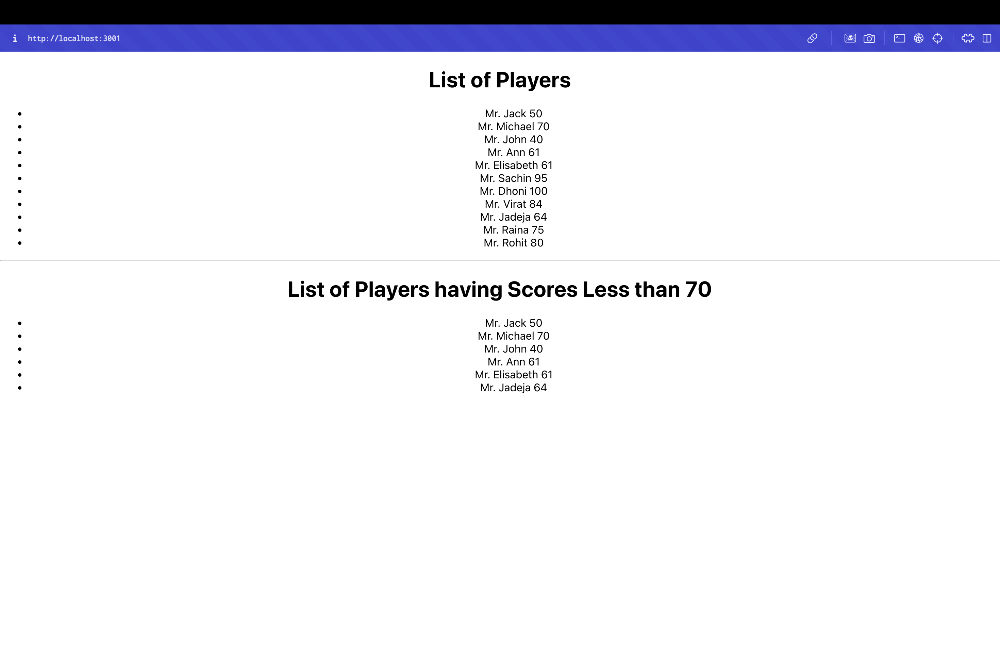

# Cricket App - ES6 Features Lab

## Objectives

- List the features of ES6
- Explain JavaScript let
- Identify the differences between var and let
- Explain JavaScript const
- Explain ES6 class fundamentals
- Explain ES6 class inheritance
- Define ES6 arrow functions
- Identify set(), map()

## Learning Outcomes

In this hands-on lab, you will learn how to:
- Use map() method of ES6
- Apply arrow functions of ES6
- Implement Destructuring features of ES6

## Prerequisites

The following is required to complete this hands-on lab:
- Node.js
- NPM
- Visual Studio Code

## Project Overview

This React application demonstrates various ES6 features through a cricket-themed interface. The app showcases:

- **ES6 Map Method**: Iterating over arrays with map()
- **Arrow Functions**: Using arrow functions for filtering and mapping
- **Destructuring**: Array destructuring for extracting specific elements
- **Spread Operator**: Merging arrays using spread syntax
- **Conditional Rendering**: Using if-else statements for different outputs

## Components

### ListofPlayers Component
- **File**: `src/ListofPlayers.js`
- **Type**: Functional Component
- **ES6 Features**: map() method, arrow functions
- **Functionality**: Displays all 11 players with their scores

### Scorebelow70 Component
- **File**: `src/Scorebelow70.js`
- **Type**: Functional Component
- **ES6 Features**: Arrow functions, map() method
- **Functionality**: Filters and displays players with scores ≤ 70

### IndianPlayers Component
- **File**: `src/IndianPlayers.js`
- **Type**: Multiple exported functions and components
- **ES6 Features**: Destructuring, spread operator, arrow functions

#### OddPlayers Function
- **Feature**: Array destructuring
- **Functionality**: Extracts first, third, and fifth elements

#### EvenPlayers Function
- **Feature**: Array destructuring
- **Functionality**: Extracts second, fourth, and sixth elements

#### IndianPlayers Array
- **Feature**: Spread operator
- **Functionality**: Merges T20Players and RanjiTrophyPlayers arrays

#### ListofIndianPlayers Component
- **Feature**: map() method with arrow functions
- **Functionality**: Displays merged Indian players list

## Project Structure

```
src/
├── ListofPlayers.js      # Component using map() method
├── Scorebelow70.js       # Component using arrow functions
├── IndianPlayers.js      # Destructuring and merge features
├── App.js               # Main app with conditional rendering
├── App.css              # Application styles
└── index.js             # Entry point
```

## ES6 Features Demonstrated

### 1. Map Method
```javascript
players.map((item) => (
  <li key={item.name}>
    Mr. {item.name} <span>{item.score}</span>
  </li>
))
```

### 2. Arrow Functions
```javascript
const Scorebelow70 = ({ players }) => {
  // Component logic
};
```

### 3. Array Destructuring
```javascript
export function OddPlayers([first, , third, , fifth]) {
  return (
    <div>
      <li>First: {first}</li>
      <li>Third: {third}</li>
      <li>Fifth: {fifth}</li>
    </div>
  );
}
```

### 4. Spread Operator
```javascript
const T20Players = ['First Player', 'Second Player', 'Third Player'];
const RanjiTrophyPlayers = ['Fourth Player', 'Fifth Player', 'Sixth Player'];
export const IndianPlayers = [...T20Players, ...RanjiTrophyPlayers];
```

## Player Data

### Main Players Array (11 players)
- Jack (50), Michael (70), John (40), Ann (61), Elisabeth (61)
- Sachin (95), Dhoni (100), Virat (84), Jadeja (64), Raina (75), Rohit (80)

### Indian Team Array
- ['Sachin1', 'Dhoni2', 'Virat3', 'Rohit4', 'Yuvaraj5', 'Raina6']

### Merged Arrays
- T20Players: ['First Player', 'Second Player', 'Third Player']
- RanjiTrophyPlayers: ['Fourth Player', 'Fifth Player', 'Sixth Player']

## Getting Started

### Prerequisites

- Node.js
- NPM
- Visual Studio Code

### Installation

1. Navigate to the project directory
2. Install dependencies:
   ```bash
   npm install
   ```

### Running the Application

Start the development server:
```bash
npm start
```

Open [http://localhost:3000](http://localhost:3000) to view the application.

## Expected Output

### When Flag = true
The application displays:
1. **List of Players**: All 11 players with their scores
2. **List of Players having Scores Less than 70**: Filtered list showing players with scores ≤ 70



The screenshot shows the successful rendering of the Cricket App in the browser at localhost:3001, displaying the "List of Players" with all 11 players and their scores, followed by the "List of Players having Scores Less than 70" showing the filtered players with scores ≤ 70, demonstrating the ES6 map() method and arrow functions functionality.

### When Flag = false
The application displays:
1. **Indian Team** section with:
   - **Odd Players**: First, Third, Fifth players using destructuring
   - **Even Players**: Second, Fourth, Sixth players using destructuring
2. **List of Indian Players Merged**: Combined list of T20 and Ranji Trophy players

## Key Concepts Demonstrated

- **ES6 Map Method**: Array iteration with map()
- **Arrow Functions**: Concise function syntax
- **Array Destructuring**: Extracting specific array elements
- **Spread Operator**: Merging arrays
- **Conditional Rendering**: Different outputs based on flag value
- **Component Composition**: Multiple components working together

## Available Scripts

- `npm start` - Runs the app in development mode
- `npm test` - Launches the test runner
- `npm run build` - Builds the app for production
- `npm run eject` - Ejects from Create React App

## Learn More

- [React Documentation](https://reactjs.org/)
- [ES6 Features](https://developer.mozilla.org/en-US/docs/Web/JavaScript/New_in_JavaScript/ECMAScript_2015_support_in_Mozilla)
- [Arrow Functions](https://developer.mozilla.org/en-US/docs/Web/JavaScript/Reference/Functions/Arrow_functions)
- [Array Destructuring](https://developer.mozilla.org/en-US/docs/Web/JavaScript/Reference/Operators/Destructuring_assignment)
- [Spread Operator](https://developer.mozilla.org/en-US/docs/Web/JavaScript/Reference/Operators/Spread_syntax)
